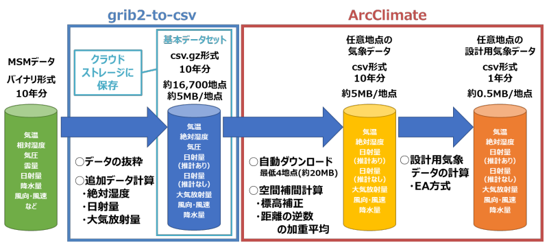

# ArcClimate

ArcClimate (hereafter referred to as "AC") is a program that creates a design meteorological data set for any specified point, such as temperature, humidity, horizontal surface all-sky radiation, downward atmospheric radiation, wind direction and wind speed, necessary for estimating the heat load of a building, based on the mesoscale numerical prediction model (hereafter referred to as "MSM") produced by the Japan Meteorological Agency, by applying elevation correction and spatial interpolation.

AC automatically downloads the data necessary to create a specified arbitrary point from data that has been pre-calculated and stored in the cloud (hereinafter referred to as "basic data set"), and creates a design meteorological data set for an arbitrary point by performing spatial interpolation calculations on these data.



The area for which data can be generated ranges from 22.4 to 47.6°N and 120 to 150°E, including almost all of Japan's land area (Note 1). The data can be generated for a 10-year period from January 1, 2011 to December 31, 2020 (Japan Standard Time). 10 years of data or one year of extended AMeDAS data (hereinafter referred to as "EA data") generated from 10 years of data can be obtained.

Note1: Remote islands such as Okinotori-shima (southernmost point: 20.42°N, 136.07°E) and Minamitori-shima (easternmost point: 24.28°N, 153.99°E) are not included. In addition, some points cannot be calculated if the surrounding area is almost entirely ocean (elevation is less than 0 m).

*Read this in other languages: [English](README.md), [日本語](README.ja.md).*

## Usage Environment 

[Python](htts://www.python.org/) 3.8 is assumed.
Quick Start assumes Ubuntu, but it also works on Windows. For example, `python` instead of `python3` or `pip` instead of `pip3` may be used. Please change the reading according to your environment.


## Quick Start

The following command will generate a standard year weather data file for the specified latitude and longitude point.

```
$ pip3 install git+https://github.com/DEE-BRI/arcclimate.git
$ arcclimate 36.1290111 140.0754174 -o kenken_EA.csv --mode EA 
```

You can specify any longitude and latitude in Japan.
The latitude and longitude of an arbitrary point can be obtained from GoogleMap or other sources.
For example, if you search for the Building Reserch Institute in GoogleMap, you can get the URL as below,
`https://www.google.co.jp/maps/place/国立研究開発法人建築研究/@36.1290111,140.0754174....` .
In this URL, 36.1290111 is latitude and 140.0754174 is longitude.

Enter the latitude and longitude information obtained on the command line and run the program.
```
$ arcclimate 36.1290111 140.0754174 -o weather.csv
```

After the necessary data is retrieved from the network, the correction process is executed.
The results are saved in `weather.csv`.

## Output CSV items

1. date ... Reference time. JST (Japan Standard Time). Except for the average year, which is displayed as 1970.
2. TMP ... Instantaneous value of temperature at the reference time (unit: °C)
3. MR ... Instantaneous value of mass absolute humidity (humidity ratio) at the reference time (unit: g/kg(DA))
4. DSWRF_est ... Hourly integrated value of estimated solar radiation before the reference time (unit: MJ/m2)
5. DSWRF_msm ... Hourly integrated value of solar radiation before the reference time (unit: MJ/m2)
6. Ld ... Hourly integrated value of downward atmospheric radiation before the reference time (unit: MJ/m2)
7. VGRD ... North-south component (V-axis) of wind speed (unit: m/s)
8. UGRD ... East-west component (U-axis) of wind speed (unit: m/s)
9. PRES ... Atmospheric pressure (unit: hPa)
10. APCP01 ... Hourly integrated value of precipitation before the reference time (unit: mm/h)
11. w_spd ... Instantaneous value of wind speed at the reference time (unit: m/s)
12. w_dir ... Instantaneous value of wind direction at the reference time (unit: °)

Weather data (.has) for [HASP](https://www.jabmee.or.jp/hasp/) can also be output.
The output weather data for HASP will reflect only the values for outside temperature (unit: °C), absolute humidity (unit: g/kgDA), wind direction (16 directions), and wind speed (unit: m/s).
Zero is output for normal surface direct irradiance, horizontal surface sky irradiance, and horizontal surface nighttime irradiance.

Weather data (.epw) for [EnergyPlus](https://energyplus.net/) can also be output.
However, only the outside temperature (unit: °C), wind direction (unit: °), wind speed (unit: m/s), and total precipitation (unit: mm/h) are output.

When generating weather data for HASP or EnergyPlus, please add command line options like `-f HAS` or `-f EPW`.

## Author

ArcClimate Development Team

## License

Distributed under the MIT License. See [LICENSE](LICENSE.txt) for more information.

## Acknowledgement

This is a programmed version of the construction method that is a product of the Building Standard Development Promotion Project E12, "Study to Detail Climatic Conditions Assumed for Assessment of Energy Consumption Performance.

The data obtained from this program is secondary processed data based on the data published by the Japan Meteorological Agency. The JMA has the rights to the original data.
